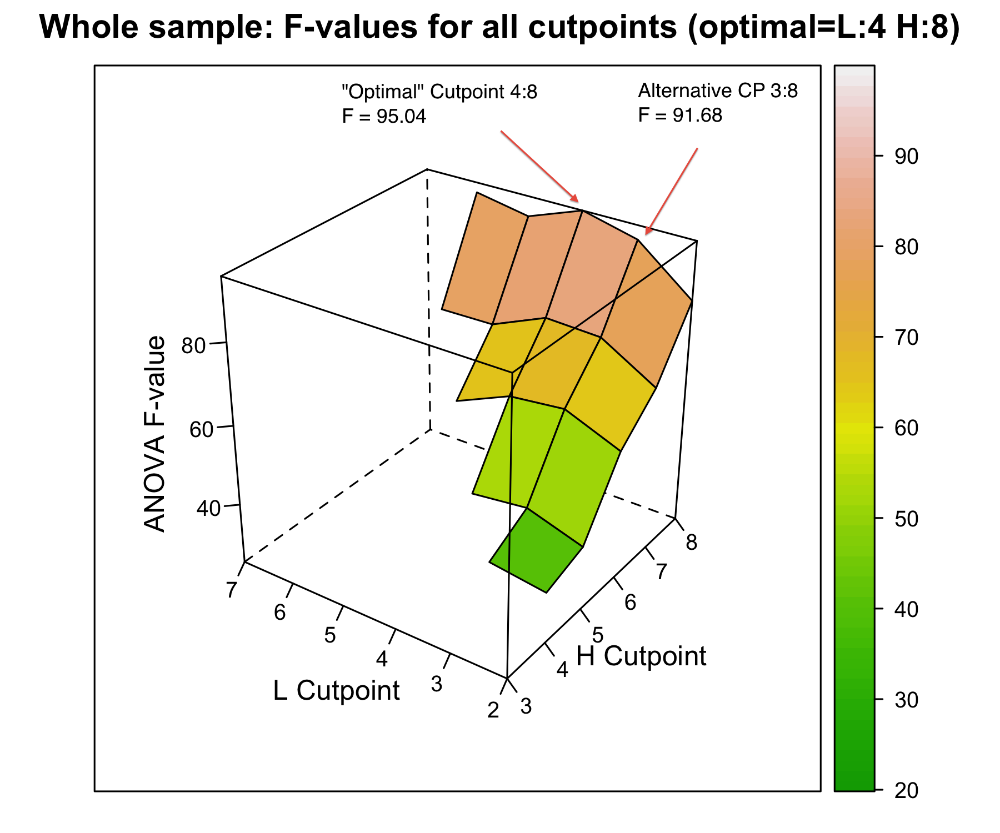

% All you need is text - Markdown (via pandoc) for academia
% Gerrit Hirschfeld
% German Paediatric Pain Centre, Children’s Hospital Datteln, Germany

# Introduction
Many students struggle to find an adequte format for their thesis. Ironically the advent of "modern" WYSIWYG programms seems to make it harder to consistently format a text. 

While learning LaTeX may be a bit too much to ask for, [markdown](http://daringfireball.net/projects/markdown/) is a very minimal language that together with [pandoc](http://johnmacfarlane.net/pandoc/) affords all typesetting needs for an academic paper. While the source document in markdown can be opened on any pc, pandoc can translate  it into beautifully formatted pdf and docx (if it is absolutely necessary) files. Specifically markdown implements:

- Headings, Subheadings
- Figures and tables
- Citations and References (here in APA6 but other styles are also possible)
- You will need to edit the file paper_v1.md

Once pandoc and latex is installed the following command generates the pdf

    pandoc -s -S --biblio biblio.bib --csl apa.csl -N -V geometry:margin=1in paper_v1.md -o paper.pdf  

# What Markdown can do for you
# Headings
## Subheadings
### Subsubheadings
#### and so forth

## Fonts
*italics*
**bold** 

## Lists
- something
- another thing

1. or
2. even
3. numbered

\newpage  

## Tables

  Right     Left     Center     Default
-------     ------ ----------   -------
     12     12        12            12
    123     123       123          123
      1     1          1             1
Table:  Demonstration of simple table syntax.

## Images

  

## Citations
Pandoc supports the use of csl reference styles. That means that it is really easy to use comparatively complex conventions such as APA6. The figure is taken from [@textbfHirschfeld2013].

In order to change the reference style simply give another csl-file.  
    
    pandoc -s -S --biblio biblio.bib --csl apa.csl -N -V geometry:margin=1in paper_v1.md -o paper.pdf

# How you can make everthing else work
Advanced users can extend these using one or more of the following strategies:  
- Use more LaTeX right in between the markdown  
- Have a look at the pandoc options  
- Use Pandoc to generate a tex-file first  
- Use themes! Pandoc supports both LaTeX as well as docx themes.  
- integrate your whoe dataanalysis into your markdown manuscript by using [R](http://www.r-project.org) and [knitr](http://yihui.name/knitr/).

# References
\setlength{\parindent}{-0.2in}
\setlength{\leftskip}{0.2in}
\setlength{\parskip}{8pt}
